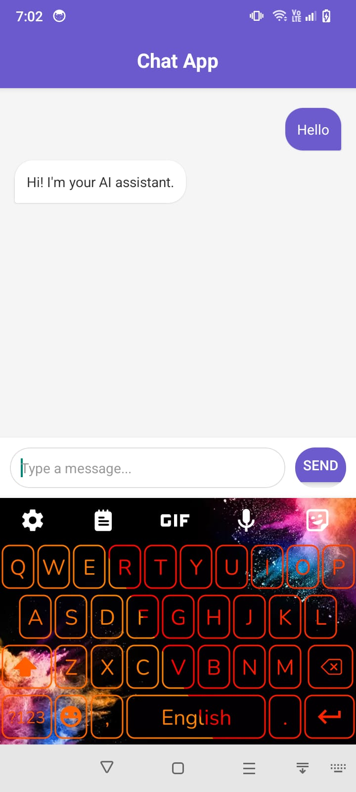

# AI Chat App - Frontend

React Native mobile application for chatting with an AI assistant.

 <!-- Add a screenshot if available -->

## Features
- Real-time chat interface
- Typing indicators
- Error handling
- Cross-platform support (Android/iOS)

## Installation & Running

### Prerequisites
- Node.js (v16+)
- Expo CLI (`npm install -g expo-cli`)
- Android Studio/Xcode (for emulator)

### Quick Start
1. Clone the repository:
   ```bash
   git clone https://github.com/AimanYaseen/ai-chat-frontend.git
   cd ai-chat-frontend
